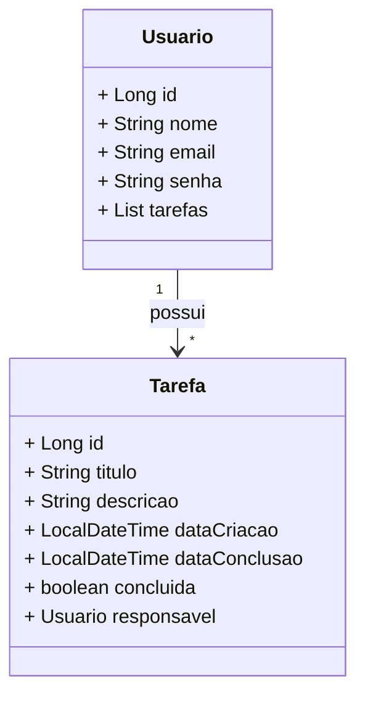

# Youtasks - Sua plataforma livre de gerenciamento de tarefas

Projeto de desenvolvimento de API REST para gerenciamento de tarefas pessoais feito durante o Desafio de Projeto do Bootcamp Santander 2024 da DIO.

## Diagrama de classes

## Referências

[1] "Santander Dev Week 2023 - falvojr". Disponível em: https://github.com/falvojr/santander-dev-week-2023